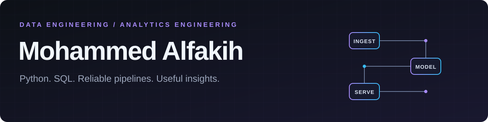

<h3>Junior Data Engineer · AI student at VU Amsterdam</h3>

From raw data to reliable pipelines and useful insights.

  
  

## About me

I'm Mohammed, a junior data engineer based in **Amsterdam**. I build with Python and SQL across API ingestion, validation, data modeling, reporting and orchestration.

🎓 **HackYourFuture Data Track completed · Career Track in progress** 
🧠 **Artificial Intelligence student at Vrije Universiteit Amsterdam**

## Featured projects

<table>
<tr>
<td colspan="2" valign="top">
<h3>📍 <a href="https://github.com/mohammedalfakih-dev/loc-events-data-platform">Loc Events Data Platform</a></h3>

A Netherlands event-discovery app built with my HYF team. I contributed Ticketmaster ingestion, transactional PostgreSQL publishing, Airflow integration and pipeline health monitoring.

<b>PYTHON · POSTGRESQL · DBT · AIRFLOW · AZURE</b>

<a href="https://github.com/mohammedalfakih-dev/loc-events-data-platform/blob/main/docs/my-contributions.md">My contributions →</a>
&nbsp; · &nbsp;
<a href="https://www.youtube.com/watch?v=iIeHOsC3xxw">Watch the app demo ↗</a>

</td>
</tr>
<tr>
<td width="50%" valign="top">
<h3>🚲 <a href="https://github.com/mohammedalfakih-dev/dutch-bike-weather-pipeline">Dutch Bike Weather</a></h3>

Weather forecasts for five Dutch cities, transformed into cycling scores with validated records, PostgreSQL upserts and Azure raw storage.

<b>PYTHON · PANDAS · PYDANTIC · AZURE</b>

</td>
<td width="50%" valign="top">
<h3>📊 <a href="https://github.com/mohammedalfakih-dev/sales-analytics-pipeline">Sales Analytics</a></h3>

Messy sales data turned into customer and revenue reports, with CSV/Parquet outputs, automated tests and a reproducible Docker run.

<b>PYTHON · PANDAS · PYTEST · DOCKER</b>

</td>
</tr>
<tr>
<td width="50%" valign="top">
<h3>🚕 <a href="https://github.com/mohammedalfakih-dev/nyc-taxi-analytics-pipeline">NYC Taxi Analytics</a></h3>

Monthly green-taxi ingestion, SQL quality audits, dbt marts and Streamlit reporting, orchestrated with Airflow and a runnable local sample.

<b>SQL · POSTGRESQL · DBT · AIRFLOW · STREAMLIT</b>

</td>
<td width="50%" valign="top">
<h3>⚡ <a href="https://github.com/mohammedalfakih-dev/nyc-taxi-databricks-lakehouse">Databricks Lakehouse</a></h3>

A yellow-taxi coursework lab with PySpark exploration, incremental daily borough models in dbt/Delta and Git-backed job scheduling.

<b>PYSPARK · DATABRICKS · DBT · DELTA LAKE</b>

</td>
</tr>
</table>

Loc Events is a team project; the contribution link identifies my work. The individual projects build on my HYF coursework, with source credits and run details in each repository.

## Tech stack

**Data & storage**

    

**Modeling & orchestration**

    

**Cloud & delivery**

   

---

<h3>Let's build something useful.</h3>

Open to <b>part-time and student roles in data engineering or analytics engineering</b> Amsterdam · Hybrid · Remote

Zeus ⚡ · Build with focus · Learn with purpose.

